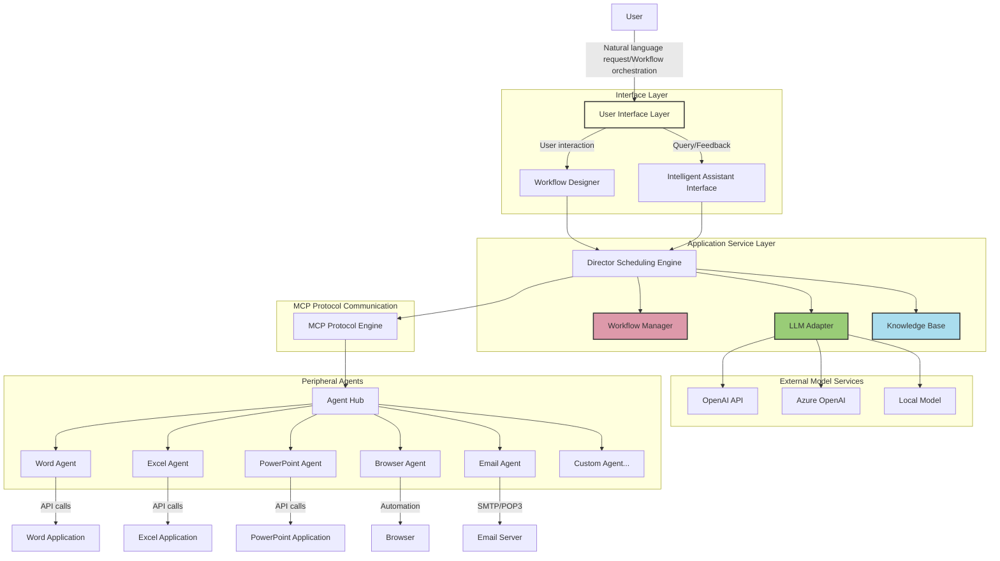

# AgenticAI.Desktop

## Project Overview

AgenticAI.Desktop is an enterprise-grade desktop AI agent application that integrates large language model capabilities with desktop software operations to create a next-generation office automation solution. This project aims to eliminate the technical barriers of traditional automation tools, allowing users to achieve complex office process automation through natural language or simple visual orchestration.

## Product Value

- **Efficiency Enhancement**: Automate repetitive and tedious office tasks to free up human resources
- **Lower Barriers**: Create automated workflows through natural language or drag-and-drop interfaces without programming knowledge
- **Flexible Extension**: Plugin architecture supports rapid integration of new desktop applications
- **Intelligent Collaboration**: Large model-enabled contextual understanding makes automation workflows smarter and more context-aware

## Core Functions

### Director Core Scheduling Engine

Director serves as the central nervous system, coordinating interactions between large language models and various desktop applications. It offers two primary working modes:

1. **Prompt-Driven Mode (Intelligent Assistant Mode)**
   - Users describe task requirements through natural language
   - The system automatically parses task intentions and plans execution paths
   - Intelligently schedules relevant Agents to perform specific operations
   - Suitable for non-technical users and temporary tasks

2. **Workflow Orchestration Mode (Professional Workflow Mode)**
   - Provides a visual process design interface with a flowchart-like drag-and-drop experience
   - Precisely controls the calling sequence, parameters, and conditional branches of various Agents
   - Supports saving, editing, and sharing workflow templates
   - Ideal for fixed processes and batch processing scenarios

### Peripheral Agents Ecosystem

Agents are functional modules that encapsulate the operational capabilities of specific desktop software and communicate with Director through the standardized MCP protocol:

- **Document Processing Agents**: Word document editing, PDF parsing and generation
- **Data Processing Agents**: Excel data analysis, database operations
- **Presentation Creation Agents**: PowerPoint slide creation and beautification
- **Network Interaction Agents**: Browser automation, web information extraction
- **Communication Collaboration Agents**: Email sending/receiving, instant messaging tool interaction

Each Agent focuses on operations in a specific domain, can be independently iterated and upgraded, forming a rich plugin ecosystem.

## Technical Architecture



### MCP Protocol Working Mechanism

MCP (Model-Command-Protocol) is the Agent communication standard protocol designed for this project, defining the following core interaction processes:

1. **Registration Phase**: Agent registers its capability description with Director upon startup
2. **Discovery Phase**: Director queries available Agent capabilities and builds capability map
3. **Execution Phase**: Director sends task commands to appropriate Agents based on user requests
4. **Feedback Phase**: Agent returns execution results and status information to Director
5. **Monitoring Phase**: Director monitors Agent health status and handles exceptions

### Core Component Function Extensions

#### Workflow Manager
- **Visual Design**: Drag-and-drop workflow designer supporting complex logic
- **Template Management**: Workflow template storage, sharing, and version control
- **Import/Export**: Allows workflow migration between different systems
- **Scheduled Execution**: Triggers workflow execution based on preset conditions or timing

#### Knowledge Base
- **Context Storage**: Saves user historical interactions and execution results
- **Reference Materials**: Stores business rules, document templates, and common data
- **Learning Optimization**: Optimizes task execution paths based on historical execution records
- **Personalized Customization**: Adjusts system behavior based on user preferences and usage habits

## User Scenarios

### Scenario One: Automated Report Generation
Users describe report requirements through natural language, and the system automatically collects data from multiple sources, performs analysis, generates charts, and outputs formatted reports.

### Scenario Two: Network Data Collection and Analysis
Users design a workflow through workflow orchestration mode that regularly collects data from specific websites, performs analysis, and generates visual reports. The system automatically completes all work according to the preset process.

## Development Roadmap

- **Phase 1**: Core framework construction, implementing Director basic functions and MCP protocol definition
- **Phase 2**: Development of the first batch of key Agents (Word, Excel, PowerPoint, Browser)
- **Phase 3**: Improvement of workflow orchestration interface and user experience
- **Phase 4**: Expansion of Agent ecosystem and opening of Agent development framework

## Technology Stack

- **Base Framework**: .NET 9.0
- **UI Framework**: .NET MAUI 9.0
- **AI Framework**: Microsoft.SemanticKernel 1.x
- **Agent Framework**: Microsoft.SemanticKernel.Agents 1.x
- **Workflow Engine**: Elsa Workflows 3.x
- **Inter-Process Communication**: Named Pipes + gRPC
- **Data Storage**: SQLite + LiteDB
- **Configuration Management**: Microsoft.Extensions.Configuration 9.0
- **Logging Framework**: Microsoft.Extensions.Logging + Serilog 9.0
- **Dependency Injection**: Microsoft.Extensions.DependencyInjection 9.0
- **Unit Testing**: xUnit + Moq

## Getting Started

### Prerequisites

- .NET 9.0 SDK
- Visual Studio 2024 or later
- Windows 10/11 (primary target platform)

### Installation

1. Clone the repository
```bash
git clone https://github.com/your-org/AgenticAI.Desktop.git
cd AgenticAI.Desktop
```

2. Restore dependencies
```bash
dotnet restore
```

3. Build the solution
```bash
dotnet build
```

4. Run the application
```bash
dotnet run --project src/Presentation/AgenticAI.Desktop.MAUI
```

## Contributing

We welcome contributions of all kinds, especially in the following areas:
- Agent plugin development
- Core architecture optimization
- User experience improvement
- Documentation enhancement

Please refer to [Contributing Guidelines](CONTRIBUTING.md) for details.

## License

This project is licensed under the MIT License - see the [LICENSE](LICENSE) file for details.

## Contact

📧 Email: contact@agenticai.com
💻 GitHub: https://github.com/your-org/AgenticAI.Desktop
📖 Documentation: https://docs.agenticai.com

---

*Built with ❤️ using .NET 9 and modern AI technologies*
