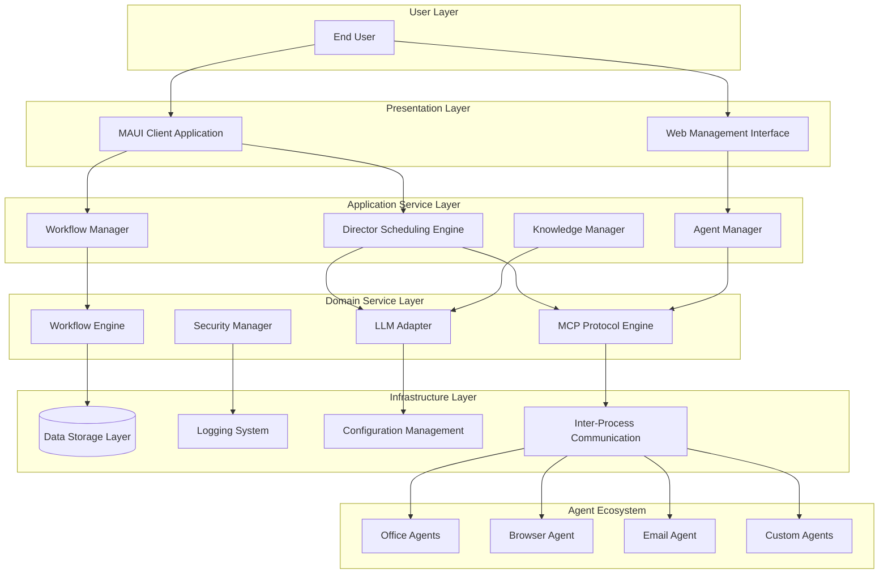
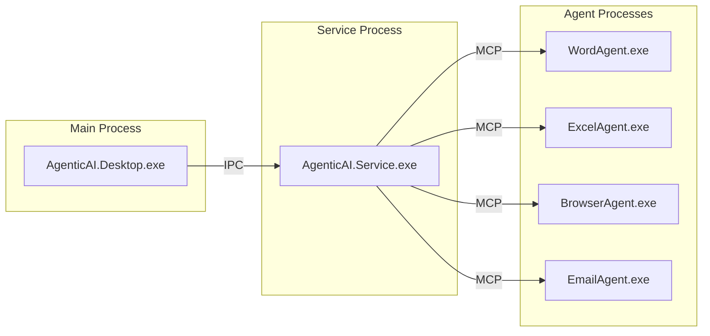
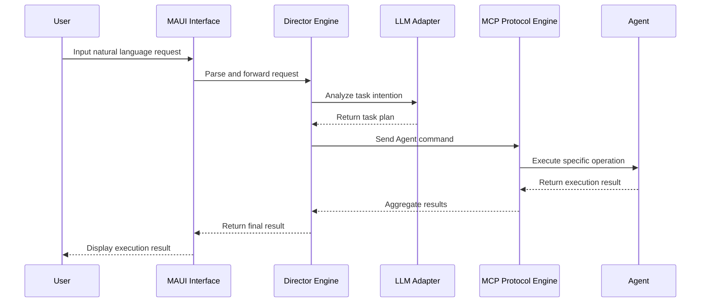

# AgenticAI.Desktop Technical Architecture Design

## Document Information

- **Document Version**: v1.0
- **Creation Date**: July 30, 2025
- **Last Updated**: July 30, 2025
- **Author**: Technical Team
- **Document Type**: Technical Architecture Design

## 1. Architecture Overview

### 1.1 Architecture Design Principles

Based on project requirements and technical constraints, this system adopts the following architectural design principles:

- **Modular Design**: High cohesion, low coupling modular architecture to ensure system maintainability and scalability
- **Plugin Architecture**: Agent adopts plugin design, supporting dynamic loading and hot-swapping
- **Protocol Standardization**: Standardized communication between components through MCP protocol
- **Asynchronous Processing**: Asynchronous programming model to improve system response performance
- **Security Isolation**: Strict Agent permission control to ensure system security
- **Cross-Platform Compatibility**: Based on .NET 9 and .NET MAUI, supporting cross-platform deployment

### 1.2 Technology Stack Selection

| Technology Domain | Selected Technology | Version | Selection Reason |
|-------------------|-------------------|---------|------------------|
| Base Framework | .NET | 9.0 | Latest LTS version, excellent performance, complete ecosystem |
| UI Framework | .NET MAUI | 9.0 | Native cross-platform support, unified development experience |
| AI Framework | Microsoft.SemanticKernel | 1.x | Microsoft official AI framework, deep integration with .NET ecosystem |
| Agent Framework | Microsoft.SemanticKernel.Agents | 1.x | Professional Agent development framework |
| Workflow Engine | Elsa Workflows | 3.x | Modern workflow engine, supports visual design |
| Inter-Process Communication | Named Pipes + gRPC | - | High-performance local communication, cross-language support |
| Data Storage | SQLite + LiteDB | - | Lightweight embedded database, no additional deployment required |
| Configuration Management | Microsoft.Extensions.Configuration | 9.0 | Standard configuration management framework |
| Logging Framework | Microsoft.Extensions.Logging + Serilog | 9.0 | Structured logging, supports multiple outputs |
| Dependency Injection | Microsoft.Extensions.DependencyInjection | 9.0 | .NET standard DI container |
| Unit Testing | xUnit + Moq | - | Mainstream testing framework combination |

### 1.3 Workflow Engine Selection

Choose **Elsa Workflows 3.x** as the workflow engine for the following reasons:

1. **Modern Architecture**: Based on latest .NET version, perfectly matches our technology stack
2. **Visual Design**: Built-in workflow designer, aligns with our "lower barriers" product goal
3. **Lightweight Integration**: Can be easily embedded into desktop applications without complex infrastructure
4. **Flexible Extension**: Supports custom activities, can easily integrate with our Agent system
5. **Persistence Support**: Supports multiple storage backends, compatible with our SQLite solution

## 2. System Architecture Design

### 2.1 Overall Architecture View



### 2.2 Layered Architecture

```text
┌─────────────────────────────────────────────────────────┐
│                    User Interaction Layer               │
│  ┌─────────────────┐  ┌─────────────────────────────┐   │
│  │  MAUI Client    │  │  Web Management Interface   │   │
│  │  Application    │  │                             │   │
│  └─────────────────┘  └─────────────────────────────┘   │
├─────────────────────────────────────────────────────────┤
│                  Application Service Layer              │
│  ┌─────────────┐ ┌─────────────┐ ┌─────────────────┐    │
│  │  Director   │ │  Workflow   │ │  Agent Manager  │    │
│  │  Engine     │ │  Manager    │ │                 │    │
│  └─────────────┘ └─────────────┘ └─────────────────┘    │
├─────────────────────────────────────────────────────────┤
│                   Domain Service Layer                  │
│  ┌─────────────┐ ┌─────────────┐ ┌─────────────────┐    │
│  │  MCP        │ │  LLM        │ │  Security       │    │
│  │  Protocol   │ │  Adapter    │ │  Manager        │    │
│  └─────────────┘ └─────────────┘ └─────────────────┘    │
├─────────────────────────────────────────────────────────┤
│                  Infrastructure Layer                   │
│  ┌─────────────┐ ┌─────────────┐ ┌─────────────────┐    │
│  │  Data       │ │  Config     │ │  Inter-Process  │    │
│  │  Storage    │ │  Management │ │  Communication  │    │
│  └─────────────┘ └─────────────┘ └─────────────────┘    │
└─────────────────────────────────────────────────────────┘
```

### 2.3 Process Architecture



### 2.4 Data Flow Architecture



## 3. Core Component Design

### 3.1 Director Scheduling Engine

**Design Goals**:
- Intelligent task parsing and planning
- Efficient Agent resource scheduling
- Support for complex workflow orchestration
- Support for task execution context persistence management

### 3.2 MCP Protocol Engine

**Design Goals**:
- Standardized Agent communication protocol
- Support for cross-process, cross-language communication
- Provide message routing and load balancing
- Implement fault detection and automatic recovery

**Core Components**:
- **Message Router**: Responsible for message distribution and routing
- **Connection Manager**: Manages Agent connection lifecycle
- **Protocol Adapter**: Supports multiple transport protocols
- **Security Gateway**: Implements authentication and authorization

**Communication Patterns**:
- Request-Response: Synchronous command execution
- Publish-Subscribe: Event notification mechanism
- Stream Processing: Large data transfer
- Heartbeat Monitoring: Health status detection

### 3.3 Agent Management System

**Design Goals**:
- Dynamic Agent discovery and registration
- Agent lifecycle management
- Load balancing and fault tolerance
- Plugin hot-swapping support

**Agent Types**:
- **Application Agents**: Automate Office suite, browsers, and other applications
- **Data Processing Agents**: Handle files, data conversion, and other tasks
- **Network Service Agents**: Call external APIs, web services
- **Custom Agents**: User-developed specialized Agents

### 3.4 Workflow Engine Integration

**Design Goals**:
- Visual workflow design interface
- Support for complex logic control (conditions, loops, parallel)
- Workflow template management and sharing
- Real-time execution monitoring and debugging

### 3.5 LLM Adapter

**Design Goals**:
- Support multiple LLM providers
- Provide unified calling interface
- Implement load balancing and fault tolerance
- Support local and cloud models

**Supported LLM Providers**:
- OpenAI GPT series
- Azure OpenAI Service
- Local models (Ollama, etc.)
- Custom API endpoints

## 4. Data Architecture

### 4.1 Data Storage Strategy

**Primary Storage**: SQLite
- User configuration and preferences
- Workflow definitions and templates
- Execution history and logs
- Agent registration information

**Cache Storage**: LiteDB
- Temporary execution context
- Agent communication cache
- Performance monitoring data

**File Storage**: Local file system
- User documents and templates
- Agent plugin files
- Log files and backups

### 4.2 Data Consistency Strategy

- **Strong Consistency**: Core configuration data
- **Eventual Consistency**: Logs and statistical data
- **Distributed Locks**: Cross-process resource access
- **Data Backup**: Regular automatic backup

## 5. Visual Studio Solution Structure

### 5.1 Solution Organization Architecture

```text
AgenticAI.Desktop.sln
├── src/
│   ├── 1.Presentation/                     # Presentation Layer
│   │   ├── AgenticAI.Desktop.MAUI/         # MAUI Client Application
│   │   └── AgenticAI.Desktop.Web/          # Web Management Interface
│   │
│   ├── 2.Application/                      # Application Layer
│   │   ├── AgenticAI.Desktop.Application.Director/      # Director Engine
│   │   ├── AgenticAI.Desktop.Application.Workflow/     # Workflow Manager
│   │   └── AgenticAI.Desktop.Application.Agent/        # Agent Manager
│   │
│   ├── 3.Domain/                          # Domain Layer
│   │   ├── AgenticAI.Desktop.Domain.Models/            # Domain Models
│   │   ├── AgenticAI.Desktop.Domain.Contracts/         # Domain Contracts
│   │   └── AgenticAI.Desktop.Domain.Services/          # Domain Services
│   │
│   ├── 4.Infrastructure/                  # Infrastructure Layer
│   │   ├── AgenticAI.Desktop.Infrastructure.Data/      # Data Access
│   │   ├── AgenticAI.Desktop.Infrastructure.MCP/       # MCP Protocol
│   │   ├── AgenticAI.Desktop.Infrastructure.LLM/       # LLM Integration
│   │   ├── AgenticAI.Desktop.Infrastructure.Security/  # Security
│   │   ├── AgenticAI.Desktop.Infrastructure.IPC/       # Inter-Process Communication
│   │   ├── AgenticAI.Desktop.Infrastructure.Config/    # Configuration Management
│   │   └── AgenticAI.Desktop.Infrastructure.Logging/   # Logging System
│   │
│   ├── 5.Agents/                          # Agent Ecosystem
│   │   ├── AgenticAI.Desktop.Agents.Core/              # Agent Base Framework
│   │   ├── AgenticAI.Desktop.Agents.Office/            # Office Agent Suite
│   │   ├── AgenticAI.Desktop.Agents.Browser/           # Browser Agent
│   │   ├── AgenticAI.Desktop.Agents.Email/             # Email Agent
│   │   └── AgenticAI.Desktop.Agents.Custom/            # Custom Agent Framework
│   │
│   └── 6.Shared/                          # Shared Components
│       ├── AgenticAI.Desktop.Shared.Contracts/         # Shared Contracts
│       ├── AgenticAI.Desktop.Shared.Models/            # Shared Models
│       └── AgenticAI.Desktop.Shared.Utilities/         # Shared Utilities
│
├── tests/                                 # Test Projects
│   ├── unit/                             # Unit Tests
│   │   ├── AgenticAI.Desktop.Tests.Unit.Director/
│   │   ├── AgenticAI.Desktop.Tests.Unit.Workflow/
│   │   └── AgenticAI.Desktop.Tests.Unit.Agent/
│   │
│   ├── integration/                      # Integration Tests
│   │   ├── AgenticAI.Desktop.Tests.Integration.API/
│   │   └── AgenticAI.Desktop.Tests.Integration.E2E/
│   │
│   └── performance/                      # Performance Tests
│       └── AgenticAI.Desktop.Tests.Performance/
│
├── tools/                                # Development Tools
│   ├── build/                           # Build Scripts
│   ├── deploy/                          # Deployment Scripts
│   └── generators/                      # Code Generators
│
├── docs/                                 # Documentation
│   ├── architecture/                    # Architecture Documentation
│   ├── api/                            # API Documentation
│   └── user/                           # User Documentation
│
└── scripts/                             # Automation Scripts
    ├── build.ps1                       # Build Script
    ├── test.ps1                        # Test Script
    └── deploy.ps1                      # Deployment Script
```

## 6. Security Architecture

### 6.1 Security Boundaries

- **Process Isolation**: Agents run in independent processes
- **Permission Control**: Role-based access control (RBAC)
- **Data Encryption**: Encrypted storage of sensitive data
- **Communication Security**: TLS/SSL encrypted communication
- **Audit Logging**: Complete operation audit tracking

### 6.2 Security Components

- **Identity Authentication**: Support for Windows integrated authentication
- **Authorization Management**: Fine-grained permission control
- **Data Protection**: DPAPI-based data encryption
- **Security Monitoring**: Real-time security event monitoring

### 6.3 Agent Security Model

**Sandbox Mechanism**:
- File system access restrictions
- Network access control
- System resource usage limits
- Inter-process communication permission control

**Permission Management**:
- Principle of least privilege
- Dynamic permission granting
- Permission audit and revocation
- Permission usage auditing

## 7. Performance Architecture

### 7.1 Performance Goals

- **Response Time**: Interface operation response < 200ms
- **Concurrent Processing**: Support 10 concurrent Agent executions
- **Memory Usage**: Idle state < 500MB
- **Startup Time**: Application startup < 5 seconds

### 7.2 Performance Strategies

- **Asynchronous Programming**: Comprehensive adoption of async/await pattern
- **Connection Pooling**: Agent connection reuse
- **Caching Strategy**: Multi-level cache design
- **Resource Management**: Timely release and recycling

### 7.3 Performance Monitoring

**Monitoring Metrics**:
- System resource utilization (CPU, memory, disk, network)
- Application performance counters
- Agent execution performance metrics
- User interface response time

**Monitoring Tools**:
- Built-in performance monitor
- Structured log analysis
- Real-time performance dashboard
- Performance report generation

## 8. Extensibility Design

### 8.1 Plugin Architecture

**Plugin Types**:
- Agent Plugins: Extend Agent functionality
- UI Plugins: Extend user interface
- Workflow Activity Plugins: Custom workflow activities
- Data Source Plugins: Support new data source types

**Plugin Management**:
- Dynamic loading and unloading
- Version compatibility checking
- Dependency relationship management
- Plugin security verification

### 8.2 API Extension

**REST API**:
- Unified RESTful interface
- OpenAPI specification support
- Version control mechanism
- Authentication and authorization

**SDK Support**:
- .NET SDK
- Python SDK
- JavaScript SDK
- Other language SDKs

### 8.3 Third-Party Integration

**Integration Methods**:
- WebHook integration
- API integration
- Message queue integration
- Database integration

**Supported Third-Party Services**:
- Cloud storage services (OneDrive, Google Drive, Dropbox)
- Office collaboration platforms (Microsoft 365, Google Workspace)
- Communication tools (Teams, Slack)
- Development tools (GitHub, Azure DevOps)

## 9. Summary

This technical architecture design follows modern software architecture best practices, adopting layered and modular design concepts to ensure the system's:

- **Maintainability**: Clear layered architecture and separation of responsibilities
- **Scalability**: Plugin design supports functional extension
- **Testability**: Dependency injection and interface abstraction facilitate testing
- **Deployability**: Flexible deployment modes adapt to different scenarios
- **Monitorability**: Complete logging and monitoring system

This architectural design provides a clear technical roadmap for project implementation, supporting orderly development according to the Visual Studio solution structure.

## 10. Next Steps

1. **Detailed Design Documents**: Based on this architectural design, develop detailed design documents for each module
2. **Prototype Development**: Prioritize implementing prototypes of core modules to validate design feasibility
3. **Performance Testing**: Develop performance testing plans to ensure the system meets performance requirements
4. **Security Review**: Conduct security design reviews to ensure the effectiveness of security mechanisms

---

*This document will be continuously updated and maintained according to project progress and technological evolution.*
